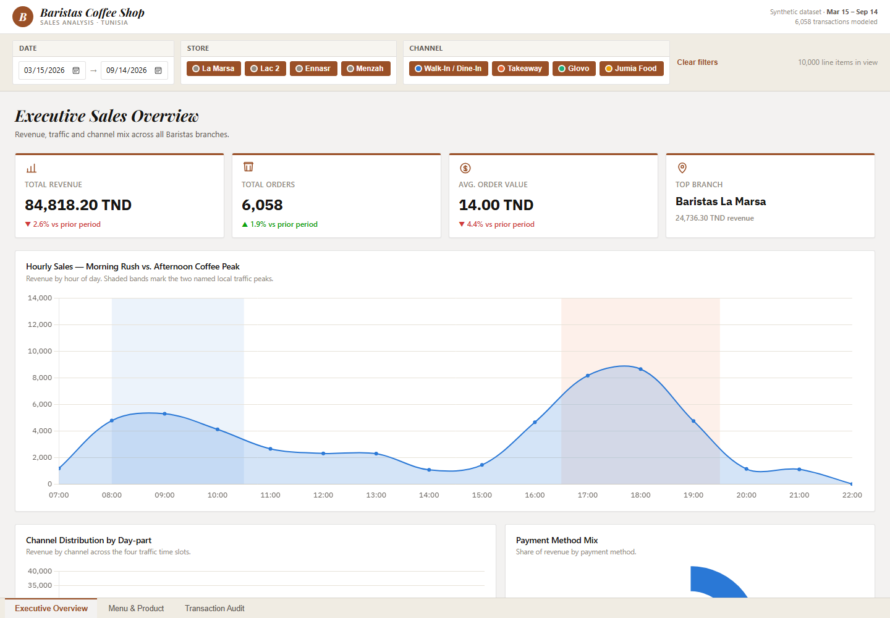

<div align="center">

# ☕ Baristas Coffee Shop — Sales Analysis Dashboard

**A Power BI-style sales analytics build for a Tunisian specialty coffee chain**
Star schema · Python ETL · DAX time intelligence · 3-page report

<p>
  
  
  
  
  
</p>

<p align="center">
  <a href="dashboard/dashboard_wireframe_spec.md"><b>Wireframe spec</b></a> ·
  <a href="dax/dax_measures_library.dax"><b>DAX library</b></a> ·
  <a href="data_architecture/star_schema_design.md"><b>Star schema</b></a> ·
  <a href="dashboard/web/index.html"><b>Interactive dashboard</b></a>
</p>



</div>

<br>

A full sales analytics build for **Baristas Coffee Shop**, a Tunisian specialty
coffee chain, covering data modeling, ETL, DAX time intelligence, and a
3-page Power BI-style report — adapted for the Tunisian market (TND pricing,
local mobile wallets, and local café traffic patterns).

## 📊 Business questions answered

- **Peak staffing alignment** — when do Morning Rush (08:00-10:30) and
  Afternoon Coffee Peak (16:30-19:30) actually hit each branch, and does
  current staffing match the load?
- **Digital payment adoption** — what share of revenue now moves through
  Carte Bancaire, Flouci and D17 versus cash, and how is that mix shifting?
- **Delivery channel economics** — how much of afternoon revenue is being
  captured by Glovo and Jumia Food versus in-store, and is that channel mix
  worth the commission?
- **Menu profitability** — which products are true Stars (high margin, high
  volume) versus Volume Drivers kept on the menu for traffic, and which
  High-Margin Niche items are under-promoted?
- **Basket-building performance** — what's the Pastry Attachment Rate, and
  which branches under-attach relative to the network average?

## 🛠️ Tech stack

**Tools:** Power BI | DAX | Power Query | Star Schema | Time Intelligence

<table>
<tr><th>Layer</th><th>Tool</th></tr>
<tr><td>Data modeling</td><td>Star schema (1 fact + 6 dimensions)</td></tr>
<tr><td>ETL / data generation</td><td>Python (pandas, NumPy)</td></tr>
<tr><td>Data transformation</td><td>Power Query (M)</td></tr>
<tr><td>Semantic layer</td><td>DAX (time intelligence, business KPIs)</td></tr>
<tr><td>Visualization</td><td>Power BI Desktop, plus a standalone interactive HTML dashboard</td></tr>
</table>

## 📁 Project structure

```
baristas-coffee-analytics/
├── data_architecture/
│   └── star_schema_design.md       # Fact/dimension grain, relationships, ER diagram
├── data_generator/
│   ├── generate_baristas_data.py   # Synthetic data generator (~10K line items, 6 months)
│   └── data/                       # Generated CSVs (fact + dimensions)
├── dax/
│   └── dax_measures_library.dax    # Copy-paste ready DAX measures
├── dashboard/
│   ├── dashboard_wireframe_spec.md # 3-page wireframe + visual field mapping
│   └── web/                        # Standalone interactive HTML/JS dashboard
│       ├── index.html
│       ├── data.js                 # Compact encoded dataset (built from data/ CSVs)
│       └── build_data.py
├── docs/
│   └── dashboard-preview.png
├── marketing/
│   └── linkedin_post.md
└── README.md
```

## 🗂️ Data model

Star schema, single-direction relationships, `Dim_Date` marked as the Power BI
date table. Full grain and column definitions in
[`data_architecture/star_schema_design.md`](data_architecture/star_schema_design.md).

```
Dim_Date ──┐
Dim_Time ──┤
Dim_Store ─┼──▶ Fact_Sales (1 row per line item)
Dim_Product┤
Dim_Payment┤
Dim_Channel┘
```

## 🚀 Getting started

1. Generate the dataset:
   ```bash
   cd data_generator
   python generate_baristas_data.py
   ```
   Produces `fact_sales.csv`, `dim_store.csv`, `dim_products.csv`,
   `dim_payment.csv`, `dim_channel.csv`, `dim_date.csv`, `dim_time.csv` in
   `data_generator/data/`.
2. **Power BI route:** Get Data → Folder → point to `data_generator/data/`.
   Build relationships per `star_schema_design.md`, mark `Dim_Date` as the
   date table, paste in the measures from `dax/dax_measures_library.dax`,
   then recreate the 3 report pages using `dashboard/dashboard_wireframe_spec.md`.
3. **Instant preview route:** open `dashboard/web/index.html` directly in a
   browser for a working interactive version of the same 3-page report,
   built from the real generated dataset (re-run `dashboard/web/build_data.py`
   after regenerating the CSVs to refresh it).

## 📈 Key outcomes (from the synthetic 6-month sample)

- ~84.8K TND in modeled revenue across 6,000+ transactions and 4 branches.
- Payment mix lands at ~55% Cash / 30% Carte Bancaire / 15% mobile wallets
  (Flouci + D17) — confirming cash still leads but digital payment adoption
  is a meaningful and trackable share of volume.
- Delivery channel share roughly doubles during the 16:30-19:30 Afternoon
  Coffee Peak versus the rest of the day, isolating exactly when Glovo/Jumia
  Food staffing and packaging capacity matter most.
- Branch performance is uneven by design (La Marsa and Lac 2 lead), giving a
  concrete basis for prioritizing expansion or staffing investment.

## 📝 Notes

- Data is synthetically generated for portfolio/demo purposes and does not
  reflect actual Baristas Coffee Shop transactions.
- Random seed is fixed (`SEED = 42`) for reproducibility.

<div align="center">
<sub>Built by <a href="https://github.com/1hamzaachour-ai">Hamza Achour</a></sub>
</div>
